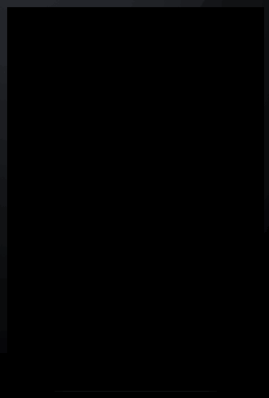

# Rotten Tomatoes

This is an IOS demo application for Rotten Tomatoes

Time spent: 5 hours spent in total

Completed user stories:

 * [x] Required: User can view a list of movies from Rotten Tomatoes. Poster images must be loading asynchronously.
 * [x] Required: User can view movie details by tapping on a cell
 * [x] Required: User sees loading state while waiting for movies API.
 * [x] Required: User sees error message when there's a networking error.
 * [x] Required: User can pull to refresh the movie list.

 

GIF created with [LiceCap](http://www.cockos.com/licecap/).
